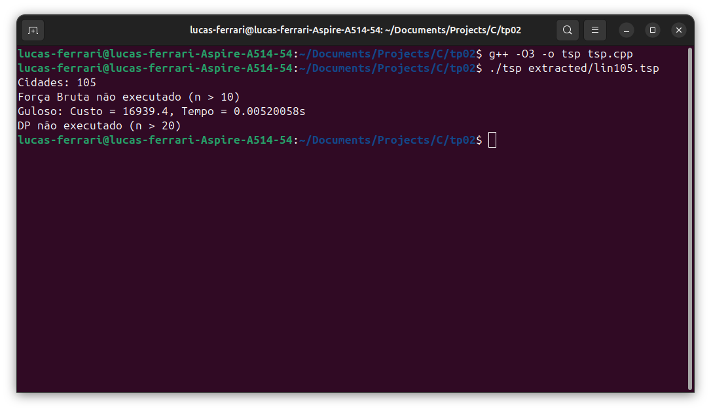

# TP02 - Implementação de Algoritmos para o Problema do Caixeiro Viajante

Trabalho prático para a disciplina DCE529 - AEDS 3

**Professor:** Iago Augusto de Carvalho  
**Data de entrega:** 14/04/2025

## Conteúdo do Projeto

- 📄 `presentation.pdf`: Slides para apresentação em sala
- 📄 `document.pdf`: Relatório técnico com análise dos algoritmos e resultados
- 💻 `tsp.cpp`: Implementação em C++ dos algoritmos para o PCV
- 📁 `extracted/`: Diretório com instâncias de teste da TSPLIB

## Como Executar o Código

1. Compile o código

```bash
g++ -O3 -o tsp tsp.cpp
```

2. Execute com a instancia

```bash
./tsp extracted/<instancia>.tsp
```


